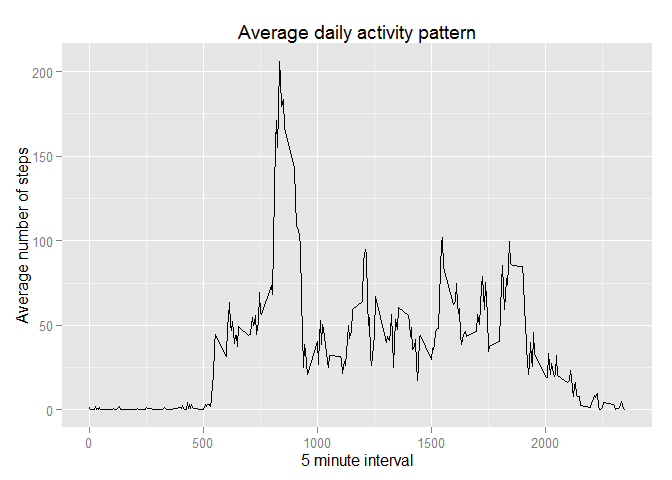

# Reproducible Research: Peer Assessment 1

Load necessary libraries:

```r
library(plyr)
```

```
## Warning: package 'plyr' was built under R version 3.2.2
```

```r
library(ggplot2)
```

## Loading and preprocessing the data

```r
unzip("activity.zip")
activity <- read.csv("activity.csv")

activity_total_daily <- ddply(activity, "date", summarise, sum.Steps = sum(steps))
activity_total_interval <- ddply(activity, "interval", summarise, avg.Steps = mean(steps, na.rm=TRUE))
```

## What is mean total number of steps taken per day?

```r
hist(activity_total_daily$sum.Steps
     ,main = "Histogram of total daily steps"
     ,xlab = "Total daily steps"
     )
```

 

Mean and Median number of steps per day

```r
mean(activity_total_daily$sum.Steps, na.rm=TRUE)
```

```
## [1] 10766.19
```

```r
median(activity_total_daily$sum.Steps, na.rm=TRUE)
```

```
## [1] 10765
```


## What is the average daily activity pattern?

```r
ggplot(data=activity_total_interval
       ,aes(x=interval
            ,y=avg.Steps)
       ) +
  geom_line() +
  xlab("5 minute interval") +
  ylab("Average number of steps") +
  ggtitle("Average daily activity pattern")
```

 


## Imputing missing values
Number of missing values in the original dataset:

```r
nrow(activity[is.na(activity$steps),])
```

```
## [1] 2304
```

Impute missing values using the median for that 5-minute interval

```r
activity_imputed <- activity
for (i in seq(1, nrow(activity)))
{
        if (is.na(activity$steps[i]))
        {
                # Use the average value for the current interval for NA values
                activity_imputed$steps[i] <-   activity_total_interval$avg.Steps[activity_total_interval$interval==activity$interval[i]]
        }
}
```

Recompute average daily values after imputing missing values

```r
activity_imp_total_daily <- ddply(activity_imputed, "date", summarise, sum.Steps = sum(steps))
```

Mean and Median daily values
Notice the difference in the Median, but not the Mean daily value:

```r
mean(activity_imp_total_daily$sum.Steps)
```

```
## [1] 10766.19
```

```r
median(activity_imp_total_daily$sum.Steps)
```

```
## [1] 10766.19
```

## Are there differences in activity patterns between weekdays and weekends?
Create new factor variable indicating if a date is a Weekday or Weekend day

```r
dayOfWeek <- weekdays(as.Date(activity_imputed$date))
activity_imputed$weekday <- factor(ifelse((dayOfWeek=="Sunday")|(dayOfWeek=="Saturday"),"weekend","weekday"))
```

Split the data into weekend and weekdays, then compute the average across the 5 minute intervals

```r
activity_imp_avg_by_weekday_int <- ddply(activity_imputed, c("weekday","interval"), summarize, avg.Steps = mean(steps))

ggplot(data=activity_imp_avg_by_weekday_int
       ,aes(x=interval
            ,y=avg.Steps)) +
        geom_line() +
        xlab("5 minute interval") +
        ylab("Average number of steps") +
        ggtitle("Average daily activity pattern") +
        facet_wrap(~weekday, ncol=1)
```

 


